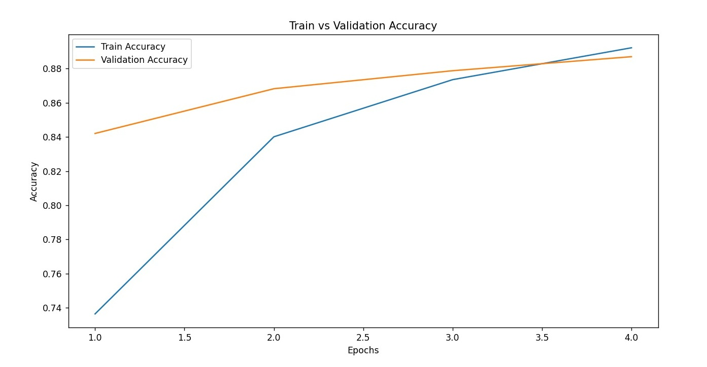

# Philosophy Text Classification Project, using Deep Learning and NLP methods

## Overview
This project focuses on classifying sentences from philosophical texts into one of four major philosophical schools: Aristotle, German Idealism, Plato, and Continental Philosophy. The dataset contains over 150,000 sentences extracted from 51 philosophical texts.

We implemented various machine learning and deep learning models, ranging from Logistic Regression to BERT, to analyze and classify these texts effectively.

---

## Project Goals
1. Develop and evaluate machine learning and deep learning models for philosophical text classification.
2. Explore text processing methods to enhance feature representation.
3. Compare the effectiveness of different model architectures.
4. Gain insights into the conceptual and ideological distinctions reflected in the dataset.

---

## Dataset
The dataset includes 150,000 sentences divided into four philosophical schools:
- **Aristotle**: 48,778 sentences
- **German Idealism**: 42,135 sentences
- **Plato**: 38,365 sentences
- **Continental**: 33,778 sentences

Extensive preprocessing was performed to ensure high-quality data for modeling.

---

## Models Implemented

### 1. Logistic Regression (LR)

#### Overview:
- **Location**: `LR/` directory
- Features:
  - Conversion methods: Bag-Of-Words, TF-IDF, Word2Vec.
  - Regularization options: None, Lasso, Ridge.
  - Optimization methods: SGD, ADAM, LBFGS.
  - Training options: With/Without Cross-Validation.

#### Text Processing
Text preprocessing steps included:
1. **Removing Irrelevant Words:** Stopwords like "is," "she," etc., were removed.
2. **Converting to Lowercase:** Ensures uniformity.
3. **Removing Punctuation Marks.**
4. **Lemmatization:** Converts words to their base forms.
5. **Vectorization:**
   - TF-IDF: Calculates importance of words.
   - Bag-Of-Words: Represents text as word frequency arrays.
   - Word2Vec: Generates semantic vectors for words.

#### Performance:
- **Bag-Of-Words Accuracy**: 65% (using SGD Optimization + Ridge Regularization)
- **TF-IDF Accuracy**: 25% (using SGD Optimization + Ridge Regularization)
- **Word2Vec Accuracy (best accuracy)**: 81% (using LBFGS Optimization + Ridge Regularization)

#### Bag-Of-Words Results:


#### Bag-Of-Words Graph:


#### TF-IDF Results:


#### TF-IDF Graph:


#### Word2Vec Results:


#### Word2Vec Graph:


#### Instructions:
To run the model:
```bash
python main_lr.py
```
Options in `main_lr.py`:
- `choosen_convert_data`: Choose a conversion method (1 - Bag-Of-Words, 2 - TF-IDF, 3 - Word2Vec).
- `choosen_training_model`: Choose training method (0 - without cross-validation, 1 - with cross-validation).
- `choosen_regularization`: Choose regularization (0 - without, 1 - Lasso, 2 - Ridge).
- `choosen_optimization`: Choose optimization (1 - SGD, 2 - ADAM, 3 - LBFGS).

---

### 2. Fully Connected Neural Network (NN)

#### Overview:
- **Location**: `NN/` directory.
- Features:
  - Two hidden layers (1024 and 512 neurons).
  - Techniques: Batch Normalization, Dropout, Learning Rate Scheduler.
  - Optimizer: Adam.

#### Performance:
- **Accuracy**: 84%


#### NN Results:


#### NN Graph:


#### Instructions:
To run the model:
```bash
python main_nn.py
```

---

### 3. Recurrent Neural Network (RNN)

#### Overview:
- **Location**: `RNN/` directory.
- Features:
  - Bidirectional LSTM with Attention.
  - Components:
    - Embedding Layer: Converts input sequences into dense vectors.
    - Bidirectional LSTM: Processes sequences in both directions.
    - Attention Layer: Focuses on the most relevant parts of the input.
  - Optimizations: Cyclic Learning Rate Scheduler, Dropout.

#### Performance:
- **Accuracy**: 85%

#### RNN Results:


#### RNN Graph:


#### Instructions:
To run the model:
```bash
python main_rnn.py
```

---

### 4. BERT

#### Overview:
- **Location**: `Bert/` directory.
- Features:
  - Pre-trained BERT model fine-tuned for text classification.
  - Optimizer: AdamW.
  - Learning Rate Scheduler: Linear schedule with warmup.

#### Performance:
- **Accuracy**: 89%

#### Bert Results:


#### Bert Graph:



#### Instructions:
To run the model:
```bash
python main_bert.py
```

---

## Directory Structure
```
project/
├── LR/      # Logistic Regression implementation
├── NN/      # Fully Connected Neural Network implementation
├── RNN/     # Recurrent Neural Network implementation
├── Bert/    # BERT implementation
├── Models/  # Trained models saved here
```

---

## Results Summary
- **Logistic Regression:** Best accuracy: **81%** (Word2Vec + Ridge Regularization).
- **NN:** Best accuracy: **84%.**
- **RNN:** Best accuracy: **85%.**
- **BERT:** Best accuracy: **89%.**

---

## How to Run
1. Clone the repository:
   ```bash
   git clone https://github.com/2shlomi9/NLP-for-Philosophers.git
   ```
2. Install dependencies:
   ```bash
   pip install -r requirements.txt
   ```
3. Run the desired model:
   - Logistic Regression:
     ```bash
     python main_lr.py
     ```
   - Neural Network:
     ```bash
     python main_nn.py
     ```
   - RNN:
     ```bash
     python main_rnn.py
     ```
   - BERT:
     ```bash
     python main_bert.py
     ```

---

## Authors
- **Matan Blaich**
- **Shlomi Zecharia**
- **Abedallah Zoabi**

---

